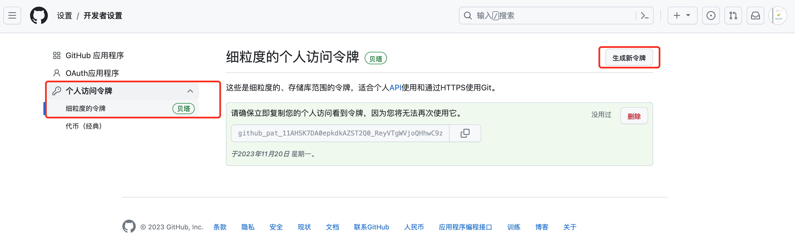

# 问题：无法上传代码

```
(xiaohui)  yuhui@yuhuideMacBook-Pro  ~/PycharmProjects/ngn_code/saibo   main ±✚  git push -u origin main
Username for 'https://github.com': silentwolfyh
Password for 'https://silentwolfyh@github.com': 
remote: Permission to silentwolfyh/silentwolfyh.github.io.git denied to silentwolfyh.
```



