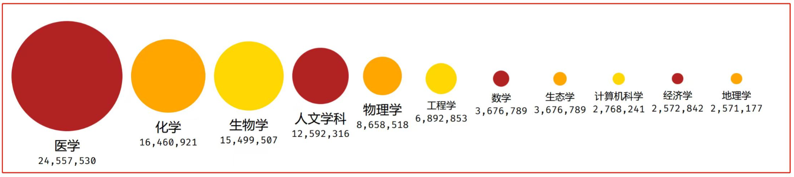
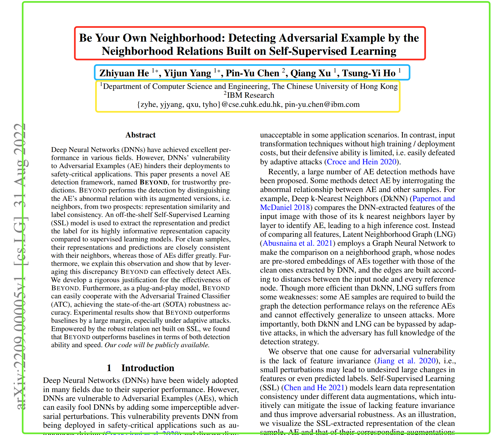
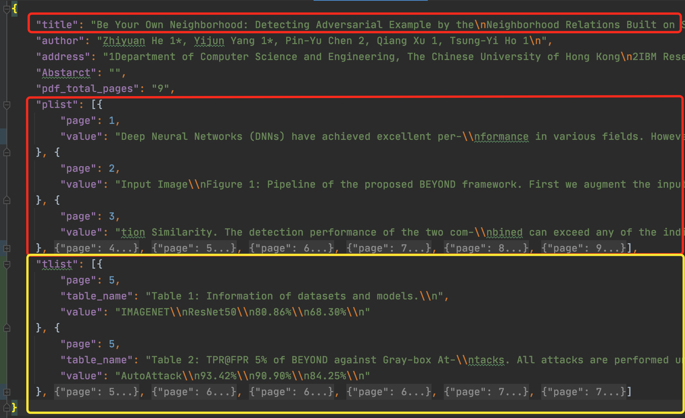

## 数据服务

本公司数据库收集了 9千万 份研究文件。大约80%的文件是发表在期刊上的研究论文 6%是会议论文集（conference proceedings）中的论文，5%是书籍的章节 剩下的就是其他种类的文件了。数据库的总规模约为100TB。

1. 论文分类如下：

|分类| 数量| |分类| 数量|
|---|---|---|---|---|
|医学 |2.4千万+| |数学 | 3百万+|
|化学 | 1.6千万+| |生态学 | 3百万+|
|生物学 | 1.5千万+| |计算机科学 | 2百万+|
|人文科学 | 8百万+| |经济学 | 2百万+|
|工程学 | 6百万+| |地理学|  2百万+|

2. 论文数据标注
本公司将9千万论文进行标注，最终通过JSON对象进行存储。
案例如下所示：

---
